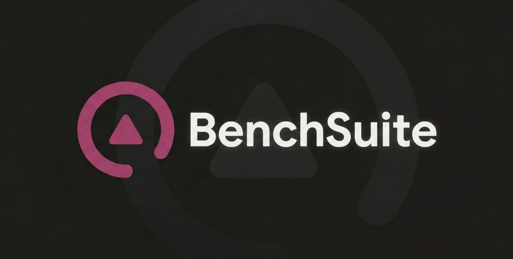
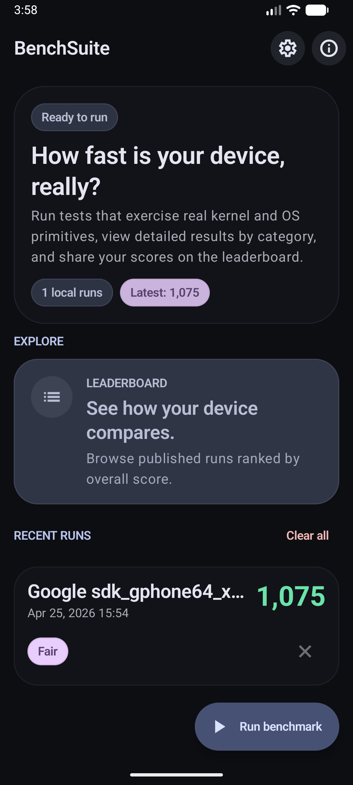
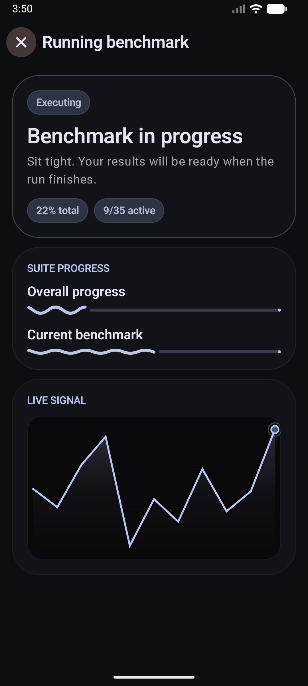
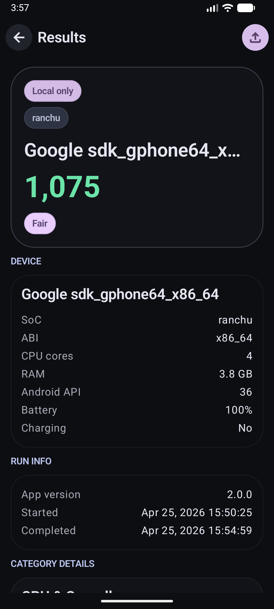
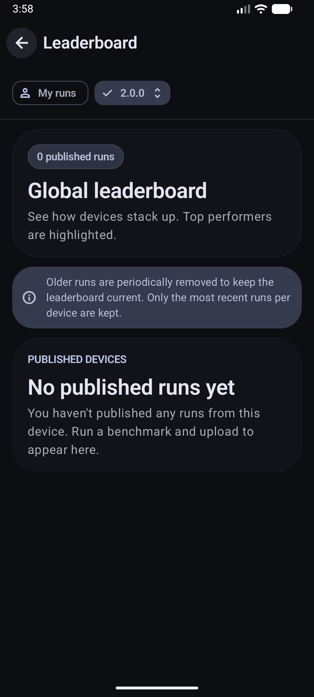
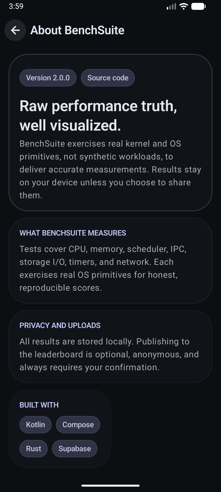

# BenchSuite 📊

Benchmarks your Android device by exercising real kernel and OS primitives, not synthetic workloads, delivering raw performance truth, well visualized.

## Features 🌟

- **CPU & Syscall** - System call overhead, CPU pipeline, and clock precision benchmarks
- **Memory** - Memory bandwidth, latency, and cache hierarchy benchmarks
- **Scheduler** - Thread wake-up latency, context switch cost, and task scheduling benchmarks
- **IPC** - Inter-process communication throughput via pipes, sockets, and shared memory
- **Storage I/O** - Sequential and random read/write throughput and IOPS for local storage
- **Network** - Loopback and local socket network throughput and latency benchmarks
- **Timers** - High-resolution timer accuracy, sleep precision, and event loop latency benchmarks
- **Rust native engine** - Benchmarks run in a Rust core via JNI for minimal overhead and consistent results
- **Leaderboard** - Submit results and compare against other devices globally
- **Stability rating** - Each run is rated for result consistency to surface thermal throttling and scheduler noise

## Screenshots 📱

## License 📄

MIT License - see [LICENSE](LICENSE)
